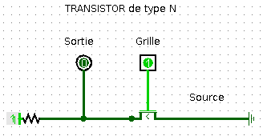
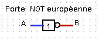
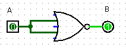
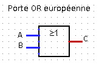
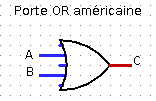

  - [Crédits](#crédits)
  - [Préambule](#préambule)
  - [Portes logiques](#portes-logiques)
      - [Le transistor porte logique de
        base](#le-transistor-porte-logique-de-base)
      - [D’autres portes logiques](#dautres-portes-logiques)
          - [Transistors en série ou en
            parallèle](#transistors-en-série-ou-en-parallèle)
          - [Portes logiques et fonctions logiques
            élémentaires](#portes-logiques-et-fonctions-logiques-élémentaires)
  - [Fonctions booléennes](#fonctions-booléennes)
      - [Fonctions booléennes](#fonctions-booléennes-1)
      - [Dresser la table de vérité d’une fonction
        booléenne](#dresser-la-table-de-vérité-dune-fonction-booléenne)
      - [Expression d’une fonction booléenne à partir de sa table de
        vérité](#expression-dune-fonction-booléenne-à-partir-de-sa-table-de-vérité)
      - [Simplification d’expressions
        booléennes](#simplification-dexpressions-booléennes)
  - [Circuits combinatoires](#circuits-combinatoires)
      - [Demi-additionneur et additionneur 1
        bit](#demi-additionneur-et-additionneur-1-bit)
      - [Décodeur avec 2 bits d’entrées](#décodeur-avec-2-bits-dentrées)

# Crédits

*Ce cours est largement inspiré du chapitre 22 du manuel NSI de la
collection Tortue chez Ellipsen auteurs : Ballabonski, Conchon,
Filliatre, N’Guyen.*

# Préambule

Les circuits d’une ordinateur manipulent uniquement des 0 ou des 1
représentés en interne par des tensions hautes ou basses. Les premiers
ordinateurs construits dans la période 1945-1950 sont basés sur une
technologie de tube à vide ou tube électrique. En 1947, aux laboratoires
Bell, [Shockley, Bardeen et
Brattain](https://fr.wikipedia.org/wiki/Transistor) inventent le
**transistor** au *germanium* un petit composant électronique qui se
comporte comme un interrupteur. Les transistors, plus petits et
dissipant moins de chaleur, vont supplanter les tubes électriques : en
1954 le *germanium* est remplacé par le *silicium*, en 1955 apparaissent
les premiers ordinteurs entièrement transistorisés, en 1960 le
transistor à effet de champ permet l’intégration de dizaines composants
dans un centimètre carré. Les transistors sont ensuite directement
gravés dans une plaque de *silicium* constitutant un **cicrcuit
intégré**. En 1965 Gordon Moore futur directeur d’Intel énonce la [loi
empirique](https://fr.wikipedia.org/wiki/Loi_de_Moore) portant son nom
qui fixe une feuille de route à l’industrie des mircroprocesseurs : le
doublement de la densité d’intégration des transistors tous les deux
ans. Cette loi s’est vérifiée jusqu’à présent avec une finesse de
gravure d’environ 5 nanomètres en 2020. Le
[graphique](https://en.wikipedia.org/wiki/Moore%27s_law#/media/File:Moore's_Law_Transistor_Count_1971-2018.png)
ci-dessous représente le nombre de transistors par circuit intégré.

<div class="center">

  

</div>

# Portes logiques

## Le transistor porte logique de base

**Définition 1**

Un **transitor** possède trois broches : la grille, la sortie (ou drain)
et la source soumis à des états de tension haute ou basse qu’on peut
assimiler aux valeurs binaires 1 et 0 d’un **bit**. Si la tension
appliquée sur la grille est haute (bit à 1) alors le transitor laisse
passer le courant entre la source d’énergie et la sortie et ce dernier
passe à l’état de tension basse (bit à 0), sinon la sortie reste en
tension haute (bit 1).

Une **fonction logique** prend un ou plusieurs bits en entrée et
retourne un ou plusieurs bits en sortie. Une **table logique**
représente toutes les sorties produites par une fonction logique pour
toutes les entrées possibles.

Un transistor représente une fonction logique dont le bit d’entrée est
l’état de tension de la grille et le bit de sortie, l’état de tension
de la sortie. La **table logique** (table 1) associée est celle du **NON
logique** ou **Inverseur**.

Fichier de test [Logisim](http://www.cburch.com/logisim/) :
[transistor.circ](circuits_logisim/transistor.circ).

<div class="center">

  

</div>

| A | B = NON(A) |
| :-: | ---------- |
| 0 | 1          |
| 1 | 0          |

**Table logique d’une porte NON**

**Il existe deux conventions de représentation symbolique des portes
logiques, une européenne et une américaine.**

<div class="minipage" width="0.5\linewidth" data-centre="true">

  
&   

</div>

## D’autres portes logiques

### Transistors en série ou en parallèle

**Exercice 1**

On donne ci-dessous les représentations de deux portes logiques :

  - La **porte NAND** constituée de deux transistors en série
  - La **porte NOR** constituée de deux transistors en parallèle

Chacune de ces portes logiques comportent deux bits d’entrée : A pour la
grille du transistor 1 et B pourla grille du transistor 2 et un bit de
sortie.

Compléter leurs tables logiques.

Vérifier avec [Logisim](http://www.cburch.com/logisim/) et les fichiers
[porte\_NAND.circ](ircuits_logisim/porte_NAND.circ) et
[porte\_NOR.circ](circuits_logisim/porte_NOR.circ).

| A | B | NAND(A, B) |
| :-: | - | ---------- |
| 0 | 0 |            |
| 0 | 1 |            |
| 1 | 0 |            |
| 1 | 1 |            |

| A | B | NOR(A, B) |
| :-: | - | --------- |
| 0 | 0 |           |
| 0 | 1 |           |
| 1 | 0 |           |
| 1 | 1 |           |

**Voici les représentations symboliques des portes logiques NAND et NOR
:**

<div class="minipage" width="0.5\linewidth" data-center="true">

  
&   

</div>

<div class="minipage" width="0.5\linewidth" data-center="true">

  
&   

</div>

### Portes logiques et fonctions logiques élémentaires

**Exercice 2**

Fichier de test [Logisim](http://www.cburch.com/logisim/) :
[exercice2.circ](circuits_logisim/exercice2.circ).

1.  Compléter la table logique de la porte logique représentée par le
    circuit ci-dessous. Quelle porte logique peut-on ainsi représenter ?

  

| A | B = f(A) |
| :-: | -------- |
| 0 |          |
| 1 |          |

2.  Compléter la table logique de la porte logique représentée par le
    circuit ci-dessous. Quelle fonction logique correspond à cette porte
    logique ?

  

| A | B | C = g(A, B) |
| :-: | - | ----------- |
| 0 | 0 |             |
| 0 | 1 |             |
| 1 | 0 |             |
| 1 | 1 |             |

**Exercice 3**

Fichier de test [Logisim](http://www.cburch.com/logisim/) :
[exercice3.circ](circuits_logisim/exercice3.circ).

1.  Compléter la table logique de la porte logique représentée par le
    circuit ci-dessous. Quelle porte logique peut-on ainsi représenter ?

  

| A | B = f(A) |
| :-: | -------- |
| 0 |          |
| 1 |          |

2.  Compléter la table logique de la porte logique représentée par le
    circuit ci-dessous. Quelle fonction logique correspond à cette porte
    logique ?

  

| A | B | C = g(A, B) |
| :-: | - | ----------- |
| 0 | 0 |             |
| 0 | 1 |             |
| 1 | 0 |             |
| 1 | 1 |             |

**Voici les représentations symboliques des portes logiques `AND` et
`OR` :**

<div class="minipage" width="0.5\linewidth" data-center="true">

  
&   

</div>

<div class="minipage" width="0.5\linewidth" data-center="true">

  
&   

</div>

**Exercice 4**

1.  Construire un circuit représentant une porte `OR` uniquement avec
    des portes `NOR`.
2.  Construire un circuit représentant une porte `AND` uniquement avec
    des portes `NAND`.

Ainsi chacune des portes, `NAND` ou `OR` permet de construire les portes
`NOT`, `OR`, `AND`. Toute porte logique pouvant logique pouvant
s’exprimer à l’aide de ces trois portes, les portes `NAND` et `OR`
sont dites *universelles*.

# Fonctions booléennes

## Fonctions booléennes

**Définition 2**

  - Un **booléen** est un type de données pouvant prendre deux valeurs
    `True` (Vrai) ou `False` (Faux) qu’on représente numériquement par
    un **bit** de valeur \(1\) pour `True` ou \(0\) pour `False`.
    Electroniquement, les valeurs 1 et 0 se traduisent respectivement
    par des tensions haute ou basse.
  - Une **fonction booléenne** \(f\) associe un booléen à un ou
    plusieurs booléens.
  - Une **fonction booléenne** avec \(n\) arguments est définie sur un
    ensemble \(\{0;1\}^n\) à \(2^n\) valeurs et prend ses valeurs dans
    \(\{0;1\}\) qui a \(2\) éléments. On peut recenser les \(2^n\)
    évaluations d’une fonction booléenne à \(n\) arguments dans une
    **table de vérité** qui la définit entièrement. Il existe
    \(2^{2^n}\) fonctions booléennes à \(n\) arguments.
  - Une **porte logique** est la représentation sous forme de circuit
    d’une fonction booléenne et sa **table logique** est la **table de
    vérité** de cette fonction.

**Exercice 5**

1.  Compléter la fonction `Python` ci-dessous pour qu’elle affiche la
    table de vérité d’une fonction booléenne à deux entrées. Expliquer
    le rôle de la fonction `int`.

<!-- end list -->

``` python
def table_verite_2bits(fonction):
    print('|{:^10}|{:^10}|{:^15}|'.format('a','b',fonction.__name__+'(a,b)'))
    for a in .............:
        for b in .............:
            print('|{:^10}|{:^10}|{:^15}|'.format(......, ......, 
            int(fonctionbool(a,b))))
```

1.  Vérifier que les tables de vérité affichées pour les fonctions
    `bool.__or__`, `bool.__and__` et `bool.__not__` sont correctes.

<!-- end list -->

``` python
In [4]: table_verite_2bits(bool.__or__)                                                                                                                                           
|    a     |    b     |  __or__(a,b)  |
|    1     |    1     |       1       |
|    1     |    0     |       1       |
|    0     |    1     |       1       |
|    0     |    0     |       0       |
```

**Propriété 1**

On peut exprimer toute fonction booléenne à l’aide de trois fonctions
booléennes élémentaires :

  - La *négation* de \(x\) est une fonction à 1 bit d’entrée (unaire)
    notée \(\neg x\) ou \(\overline{x}\).  
    Si `x` est un booléen, sa *négation* est `not x` en `Python`.

| \(x\) | \(\neg x\) |
| :---: | ---------- |
|   0   |            |
|   1   |            |

  - La *conjonction* de \(x\) et \(y\) est une fonction à 2 bits
    d’entrée (binaire) notée \(x \wedge y\) ou \(x . y\).  
    Si `x` et `y` sont des booléens, leur *conjonction* est `x and y` en
    `Python`.

| \(x\) | \(y\) | \(x \wedge y\) |
| :---: | ----- | -------------- |
|   0   | 0     |                |
|   0   | 1     |                |
|   1   | 0     |                |
|   1   | 1     |                |

  - La *disconjonction* de \(x\) et \(y\) est une fonction à 2 bits
    d’entrée (binaire) notée \(x \vee y\) ou \(x + y\).  
    Si `x` et `y` sont des booléens, leur *disjonction* est `x or y` en
    `Python`

| \(x\) | \(y\) | \(x \vee y\) |
| :---: | ----- | ------------ |
|   0   | 0     |              |
|   0   | 1     |              |
|   1   | 0     |              |
|   1   | 1     |              |

**Propriété 2**

1.  Les fonctions booléennes élémentaires respectent un certain nombre
    de règles qui permettent de simplifier les expressions booléennes
    complexes :

<!-- end list -->

  - *opérateur involutif* : \(\neg(\neg x) = x\) et
    \(\overline{\overline{x}}=x\)
  - *élément neutre* : \(1 \wedge x = x\) et \(1 . x =x\) ou
    \(0 \vee x = x\) et \(0 + x =x\)
  - *élément absorbant* : \(0 \wedge x = 0\) et \(0 . x =0\) ou
    \(1 \vee x = x\) et \(1 + x =1\)
  - *idempotence* : \(x \wedge x = x\) et \(x . x =x\) ou
    \(x \vee x = x\) et \(x + x =x\)
  - *complément* : \(x \wedge (\neg x) = 0\) et
    \(x . (\overline{x}) =0\) ou \(x \vee (\neg x) = 1\) et
    \(x + \overline{x} =1\)
  - *commutativité* : \(x \wedge y = y \wedge x\) et \(x . y = y . x\)
    ou \(x \vee y = y \vee x\) et \(x + y = y + x\)
  - *associativité* : \(x \wedge ( y \wedge z) = (x \wedge y) \wedge z\)
    et \(x . (y . z) = (x . y) . z\) ou
    \(x \vee ( y \vee z) = (x \vee y) \vee z\) et
    \(x + (y + z) = (x + y) + z\)
  - *distributivité* :
    \(x \wedge ( y \vee z) = (x \wedge y) \vee (x \wedge z)\) et
    \(x . (y + z) = x . y + x z\) ou
    \(x \vee ( y \wedge z) = (x \vee y) \wedge (x \vee z)\) et
    \(x + (y . z) = (x + y) . (x + z)\)
  - *loi de Morgan* : \(\neg(x \wedge y) = \neg x \vee \neg y\) et
    \(\overline{x . y} = \overline{x} + \overline{y}\) ou
    \(\neg(x \vee y) = \neg x \wedge \neg y\) et
    \(\overline{x + y} = \overline{x} . \overline{y}\)

<!-- end list -->

2.  Les fonctions booléennes élémentaire respectent des règles de
    priorité : la *négation* est prioritaire sur la *conjonction* qui
    est proritaire sur la *disjonction*.  
    **Il est recommandé de mettre des parenthèses plutôt que d’appliquer
    les règles de priorité dans l’écriture des expressions booléennes.**

**Exercice 6**

Démontrer dans chaque cas l’égalité des expressions booléennes en
utilisant les deux méthodes suivantes :

  - **Méthode 1** : en comparant les tables de vérité des deux
    expressions booléennes ;

  - **Méthode 2** : en utilisant les règles de simplification de la
    propriété 2.

<!-- end list -->

1.  \(x + x . y = x\)
2.  \(x + \overline{x} . y= x + y\)
3.  \(x . z + \overline{x} . y + y . z = x . z + \overline{x} . y\)
4.  \(\overline{y . (x + \overline{y})} = \overline{x} + \overline{y}\)
5.  \(x . ( \overline{x} + \overline{y}) . (x + y) = x . \overline{y}\)

**Exercice 7**

On considère la fonction booléenne dont la table de vérité est :

| \(x\) | \(y\) | \(f(x, y)\) |
| :---: | ----- | ----------- |
|   0   | 0     | 0           |
|   0   | 1     | 1           |
|   1   | 0     | 1           |
|   1   | 1     | 0           |

1.  Exprimer chacune des lignes où la fonction prend la valeur \(1\)
    comme la *conjonction* des entrées en remplaçant chaque \(1\) par la
    variable qu’il représente et chaque \(0\) par la négation de la
    variable. Par exemple le \(1\) de la deuxième ligne s’écrira
    \(\overline{x} . y\).
2.  On peut alors écrire \(f(x,y)\) comme la *disjonction* des *formes
    conjonctives* obtenues à la question précédente. En déduire une
    expression booléenne de \(f(x, y)\).
3.  Ouvrir le logiciel [Logisim](http://www.cburch.com/logisim/) et
    construire une porte logique représentant cette fonction booléenne.
4.  Cette fonction s’appelle `OU EXCLUSIF` ou `XOR`. Ce nom vous
    paraît-il bien choisi ?

## Dresser la table de vérité d’une fonction booléenne

## Expression d’une fonction booléenne à partir de sa table de vérité

## Simplification d’expressions booléennes

# Circuits combinatoires

## Demi-additionneur et additionneur 1 bit

## Décodeur avec 2 bits d’entrées
