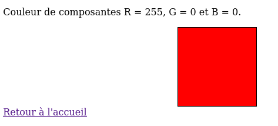
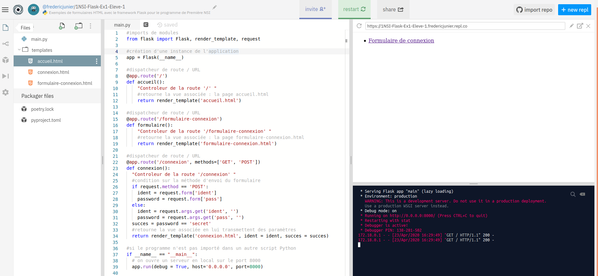
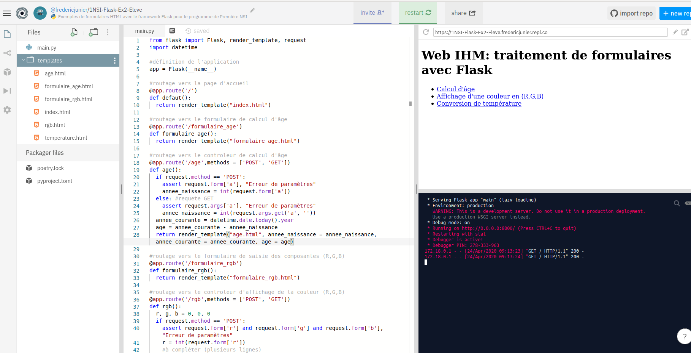

  - [Crédits](#crédits)
  - [Développement côté serveur en
    PHP](#développement-côté-serveur-en-php)
      - [Site Web dynamique](#site-web-dynamique)
      - [Un premier exemple](#un-premier-exemple)
      - [Une peu d’exercice](#une-peu-dexercice)
  - [Développement côté serveur en
    Python](#développement-côté-serveur-en-python)
      - [Un premier exemple](#un-premier-exemple-1)
      - [Un peu d’exercice](#un-peu-dexercice)

# Crédits

*Ce cours est largement inspiré du chapitre 29 du manuel NSI de la
collection Tortue chez Ellipse, auteurs : Ballabonski, Conchon,
Filliatre, N’Guyen. J’ai également consulté le prepabac Première NSI de
Guillaume Connan chez Hatier, le cours de [Romain
Janvier](http://nsi.janviercommelemois.fr/), le tutoriel PHP de
<https://www.w3schools.com/php/default.asp> et la documentation du
module [Flask](https://flask.palletsprojects.com/en/1.1.x/) de Python.*

<!-- Définition des hyperliens  -->

# Développement côté serveur en PHP

## Site Web dynamique

**Point de cours 1**

[PHP](https://developer.mozilla.org/fr/docs/Glossaire/PHP) est un
langage interprété qui s’exécute sur un serveur Web. Lorsque le serveur
reçoit les données d’un formulaire d’un client, il peut les transmettre
à un script [PHP](https://developer.mozilla.org/fr/docs/Glossaire/PHP)
qui pourra les utiliser pour modifier une base de données ou générer à
la volée le contenu
[HTML](https://developer.mozilla.org/fr/docs/Glossaire/HTML) qui sera
retournée au client.

Une page Web est dite **dynamique** si son contenu dépend du client qui
la demande et de son contexte (temps, espace, plateforme). Par
opposition, une page Web est **statique** si son contenu est le même
quel que soit le client et le contexte.

Un **site Web dynamique** s’appuie sur trois composants : un langage
interprété comme
[PHP](https://developer.mozilla.org/fr/docs/Glossaire/PHP),
[Python](https://docs.python.org/3.7/library/cgi.html) ou
[Node.js](https://developer.mozilla.org/fr/docs/Glossaire/Node.js), un
serveur Web comme [Apache](https://doc.ubuntu-fr.org/apache2) ou
[Nginx](https://doc.ubuntu-fr.org/nginx) et un système de gestion de
bases de données comme [MySQL](https://doc.ubuntu-fr.org/mysql) ou
[MariaDb](https://doc.ubuntu-fr.org/mariadb).

[PHP](https://developer.mozilla.org/fr/docs/Glossaire/PHP) est souvent
associé avec [Apache](https://doc.ubuntu-fr.org/apache2) et
[MysSQL](https://doc.ubuntu-fr.org/mysql) pour former la pile
[Lamp](https://doc.ubuntu-fr.org/lamp) nécessaire pour accueillir un
**site Web dynamique** comme un
[CMS](https://developer.mozilla.org/fr/docs/Glossaire/CMS) de type
Wordpress ou Drupal.

Les fichiers [PHP](https://developer.mozilla.org/fr/docs/Glossaire/PHP)
portent l’extension `.php` et la syntaxe du langage s’inspire de celles
de [Bash](https://doc.ubuntu-fr.org/bash) et
[Java](https://developer.mozilla.org/fr/docs/Glossaire/Java), en
particulier les blocs sont délimités par des accolades, chaque
instruction doit se terminer par un symbole `;` et chaque nom de
variable commence par le symbole `$`.

On donne ci-dessous un exemple de code
[PHP](https://developer.mozilla.org/fr/docs/Glossaire/PHP), exécutable à
partir de l’[URL](https://developer.mozilla.org/fr/docs/Glossaire/URL)
<http://frederic-junier.org/NSI/sandbox/heure.php>.

Pour générer une page Web dynamiquement, le code
[PHP](https://developer.mozilla.org/fr/docs/Glossaire/PHP) peut être
inséré directement dans du code
[HTM](https://developer.mozilla.org/fr/docs/Glossaire/HTML), à
l’intérieur de balises `<?php` et `?>`. Les commentaires peuvent être
placés entre deux symboles `/*` et `*/`.

``` php
<!DOCTYPE html>

<html lang="fr">

<head>
  <title>Affichage de l'heure avec PHP </title>
  <meta charset="utf-8">    
</head>

<body>

   <h1> Affichage de l'heure avec PHP </h1>
   
   <p> Il est : <?php echo date("H:i:s"); /* commentaire  */  ?>  </p>

</body>
</html> 
```

## Un premier exemple

**Exemple 1**

Ouvrir dans un navigateur Web la page
<https://repl.it/@fredericjunier/1NSI-PHP-Ex1-Eleve>.

La page s’ouvre sur un environnement de programmation en
[PHP](https://developer.mozilla.org/fr/docs/Glossaire/PHP) sur la
plateforme <https://repl.it>. Un serveur
[Apache](https://doc.ubuntu-fr.org/apache2) avec interpréteur
[PHP](https://developer.mozilla.org/fr/docs/Glossaire/PHP) s’exécute
dans un environnement isolé.

Il n’est pas nécessaire de se créer un compte sur celle-ci pour
travailler. Dès la première modification du fichier ouvert dans
l’éditeur, on est redirigé vers une page anonyme en lecture/écriture.

L’interface se divise en trois zones :

  - à gauche l’explorateur de fichiers, il est possible de créer des
    nouveaux fichiers dans l’interface, de les téléverser de tout
    télécharger sous forme d’archive zip
  - au centre se trouve l’éditeur de fichier pour saisir ou modifier du
    code  
  - à droite se trouve deux fenêtres de sortie : en haut un affichage de
    page Web et en bas la console affichant les commandes exécutées par
    le serveur

 

1.  Dans la page d’accueil, cliquer sur le lien **Formulaire de
    connexion avec la méthode GET**. Remplir le formulaire avec un nom
    quelconque pour l’identifiant et `secret` en minuscules pour le mot
    de passe. Réaliser un autre envoi avec un mot de passe incorrect. Le
    code source du formulaire est affiché dans la zone d’édition de
    l’image précédente. Les dpnnées du formulaire sont envoyées par la
    méthode
    [GET](https://developer.mozilla.org/fr/docs/Web/HTTP/M%C3%A9thode/GET)
    au programme `login.php` qui va les traiter. Cliquer sur `login.php`
    dans l’explorateur de fichier pour afficher son code source comme
    ci-dessous :
    
    ``` php
    <!DOCTYPE html>
    
    <html lang="fr">
    
    <head>
    <title>Affichage de l'âge avec PHP </title>
    <meta charset="utf-8">    
    </head>
    
    <body>
    
    <div>
    <?php
    echo "<p> Il est " . date("H:i:s") . "</p>"; 
    /* commentaire
    multiligne 
    */
    if ( isset($_GET['ident']) && isset($_GET['pass']) 
          && ( $_GET['pass'] ==   'secret' ) )
    {
       echo "<p> Bienvenue " . $_GET['ident'] . "</p>";
    }
    elseif ( !( empty($_POST['ident']) || empty($_POST['pass']) ) 
             && ( $_POST['pass'] == 'secret' ) )
    {
       echo "<p>Bienvenue " . $_POST['ident'] . "</p>";
    }
    else 
    {
       echo "<p> Échec de la connexion. </p>"; //commentaire isolé
    }
    ?>
    </div>
    
    <a href="index.php">Retour à l'accueil</a>
    
    </body>
    </html> 
    ```

2.  On peut relever dans cet exemple quelques traits du langage
    [PHP](https://developer.mozilla.org/fr/docs/Glossaire/PHP), que nous
    survolerons :
    
      - On l’a déjà dit le code
        [PHP](https://developer.mozilla.org/fr/docs/Glossaire/PHP) peut
        s’insérer dans du code
        [HTML](https://developer.mozilla.org/fr/docs/Glossaire/HTML),
        entre une des balises `<?php` et `?>`
      - Chaque instruction se termine par un symbole `;`
      - On peut insérer des commentaires multilignes ou isolés.
      - Les noms de variables doivent être préfixés par le symbole `$`.
      - `$_GET` est une variable spéciale qui va recevoir des données de
        formulaire transmises par la méthode `$_GET`. Il existe aussi
        une variable spéciale `$_POST`. Il s’agit de tableaux
        associatifs comme les dictionnaires en
        [Python](https://docs.python.org/3.7/library/cgi.html).
      - L’affichage sur la sortie standard du programme se fait avec
        `echo` comme en [Bash](https://doc.ubuntu-fr.org/bash), et les
        chaînes de caractères sont concaténés avec le symbole `.`.
      - Les structures de contrôle (conditions et boucles) ont des
        structures et des mots clefs similaires à tous les autres
        langages procéduraux. Contrairement à
        [Python](https://docs.python.org/3.7/library/cgi.html),
        l’indentation n’a qu’une valeur de présentation, les blocs
        d’instructions doivent donc être délimités par des symboles
        `{` et `}`.
      - Pour tester si une variable est définie on peut utiliser la
        fonction `isset` ou son contraire `empty`.
      - Les opérateurs logiques sont les mêmes qu’en
        [C](https://fr.wikipedia.org/wiki/C_\(langage\)), `&&` pour
        `and`, `||` pour `or`, `!` pour `not` et il est conseillé
        d’utiliser des parenthèses pour clarifier l’ordre souhaité.

3.  Si on édite le code source de la page d’accueil `index.php`, on peut
    remarquer des instructions
    [PHP](https://developer.mozilla.org/fr/docs/Glossaire/PHP) comme
    `<?php include('menu.php') ?>` et si on édite le fichier `menu.php`
    on y trouve un menu sous forme de liste en
    [HTML](https://developer.mozilla.org/fr/docs/Glossaire/HTML). On
    peut donc utiliser
    [PHP](https://developer.mozilla.org/fr/docs/Glossaire/PHP) comme
    gestionnaire de templates
    [HTML](https://developer.mozilla.org/fr/docs/Glossaire/HTML) et
    centraliser du code.

## Une peu d’exercice

**Exercice 1**

Ouvrir dans un navigateur Web la page
<https://repl.it/@fredericjunier/1NSI-PHP-Ex1-Eleve> présentée dans
l’exemple 1.

1.  Éditer le fichier `formulaire-age.php` et compléter le formulaire
    ci-dessous avec un élément `<input type="number" name="a">` de type
    `number` pour que l’utilisateur puisse saisir une date de naissance
    comprise entre 1900 et 2020 et que cette valeur soit associée au nom
    `a` et transmise pour traitement au script `age.php` avec la méthode
    [GET](https://developer.mozilla.org/fr/docs/Web/HTTP/M%C3%A9thode/GET).
    
    ``` html
       <form action="age.php" method="GET">
          <label for="naissance">Saisissez votre date de naissance </label> 
          <br>
          <!-- compléter -->
       </form>
    ```
    
    Tester l’envoir du formulaire puis retourner à la page d’accueil.

2.  Dans la page d’accueil, cliquer sur le lien **Formulaire de
    connexion avec la méthode POST**, saisir dans le champ identifiant
    `<script>alert('Hack !')</script>` et dans le champ mot de passe
    `secret` puis envoyer les données. Que se passe-t-il ?
    
    Faire un nouveau test en saisissant
    `<script>window.location.href='index.php'</script>`. Que se
    passe-t-il ?
    
    Résumer la définition d’une faille Cross-site scripting (XSS) à
    partir de l’article
    <https://developer.mozilla.org/fr/docs/Glossaire/Cross-site_scripting>.
    
    Modifier le code
    [PHP](https://developer.mozilla.org/fr/docs/Glossaire/PHP) du
    fichier `login.php` pour résoudre en partie cette faille à l’aide de
    la fonction `htmlspecialchars` présenté dans cet article
    <https://www.w3schools.com/php/php_form_validation.asp>.

3.  Dans la page d’accueil, cliquer sur le lien **Formulaire d’affichage
    de couleur (R,G,B)**. On arrive sur un formulaire constitué de trois
    champs `<input>` de type `number` où l’utilisateur peut saisir l’une
    des composantes (R,G,B) d’une couleur comprise entre 0 et 255. Les
    données sont envoyées au fichier `rgb.php`. Éditer ce fichier depuis
    l’explorateur et le compléter pour qu’il puisse traiter les données
    du formulaire et modifier la propriété
    [CSS](https://developer.mozilla.org/fr/docs/Glossaire/CSS)
    `background` de l’élément `<div>` identifié par `#couleur` afin
    d’afficher la couleur correspondante. Les parties de code à
    compléter sont marquées par des commentaires.
    
     
    
     

4.  Dans la page d’accueil, cliquer sur le lien **Formulaire de
    changement d’unité de température**. On arrive sur un formulaire
    `temperature.php` constitué d’un champ `<select>` permettant de
    choisir une unité source et un champ `<input>` de type `number` pour
    saisir une mesure de température. Les données du formulaire sont
    envoyées à `temperature.php` qui supporte donc à la fois la saisie
    et le traitement des données. Éditer ce fichier depuis l’explorateur
    et le compléter pour qu’il puisse traiter les données du formulaire
    en convertissant la mesure de température de Celsius en Fahrenheit
    ou réciproquement.
    
     

5.  Dans la page d’accueil, cliquer sur le lien **Formulaire d’affichage
    de table de multiplication**. On arrive sur un formulaire
    `multiplication.php` constitué d’un champ champ `<input>` de type
    `number` pour saisir un facteur. Les données du formulaire sont
    envoyées au même fichier `multiplication.php`. Éditer ce fichier
    depuis l’explorateur et le compléter pour qu’il puisse traiter les
    données du formulaire en affichant la table des 11 premiers
    multiples du nombre choisi.

 

**Exercice 2**

*QCM* de type E3C2.

1.  Parmi les quatre propositions suivantes, laquelle est la seule à
    correspondre à un entête correct de formulaire d’une page HTML ?
    
      - Réponse A : `<form method="formulaire.php" action="submit">`
      - Réponse B : `<form method="post" action=onclick()>`
      - Réponse C : `<form method="get" action="arret.php">`
      - Réponse D : `<form method="post" action=arret.php>`

2.  Quel langage est interprété ou exécuté côté serveur ?
    
      - Réponse A : JavaScript
      - Réponse B : PHP
      - Réponse C : HTML
      - Réponse D : CSS

3.  Pour analyser les réponses saisies par l'utilisateur dans un
    formulaire d’une page Web personnelle, hébergée chez unfournisseur
    d'accès à internet, on dispose du code suivant :
    
    ``` php
    <?php if ($_POST['choix']=='choix4'){echo 'Bravo,';}
    else {echo "Non, vous vous trompez !";}
    ?>
    ```
    
    Où s’exécutera ce code ?
    
      - Réponse A : dans le premier routeur permettant d’accéder au
        serveur
      - Réponse B : dans le dernier routeur permettant d’accéder au
        serveur
      - Réponse C : dans le serveur qui héberge la page personnelle
      - Réponse D : dans la machine de l’utilisateur qui consulte la
        page personnelle

4.  Le site internet d’un quotidien d’information permet aux visiteurs
    de laisser des commentaires textuels. Ces commentaires doivent être
    visibles par les autres visiteurs. Laquelle des affirmations
    suivantes est correcte ?
    
      - Réponse A : Il suffit que la page HTML contienne des champs de
        la forme `<textarea>`
      - Réponse B : Il suffit que la page HTML contienne des champs de
        la forme `<textarea>` et d’utiliser JavaScript pour enregistrer
        les commentaires
      - Réponse C : Il faut un programme en PHP ou un script Python sur
        le serveur pour traiter les données
      - Réponse D : Non, ce n’est pas possible avec la technologie
        actuelle

5.  Dans quels langages les balises `` et `<form>` sont-elles
    utilisées ?
    
      - Réponse A : Python
      - Réponse B : HTML
      - Réponse C : Javascript
      - Réponse D : PHP

# Développement côté serveur en Python

## Un premier exemple

**Exemple 2**

[Flask](https://flask.palletsprojects.com/en/1.1.x/) est un micro
[Framework](https://fr.wikipedia.org/wiki/Framework) permettant de
développer des applications Web en
[Python](https://docs.python.org/3.7/library/cgi.html). Il impose peu de
choix prédéfinis au programmeur.

1.  Ouvrir dans un navigateur Web la page
    d’[URL](https://developer.mozilla.org/fr/docs/Glossaire/URL)
    <https://repl.it/@fredericjunier/1NSI-Flask-Ex1-Eleve-1>.

2.  On arrive sur un environnement de programmation Web intégrant une
    mini application écrite avec
    [Flask](https://flask.palletsprojects.com/en/1.1.x/).
    
      
    
      - Tout le code
        [Python](https://docs.python.org/3.7/library/cgi.html) de
        l’application est rassemblé dans le fichier `main.py` ouvert
        dans l’éditeur :
        
          - On importe d’abord les modules nécessaires avec `import`
          - A la fin du programme, un serveur Web de développement est
            lancé avec le dégogueur activé.
          - Entre les deux, on trouve une série de déclarations de
            fonctions précédées du décorateur `@app.route`. Le
            décorateur est le *routeur* : si
            l’[URL](https://developer.mozilla.org/fr/docs/Glossaire/URL)
            se termine par `/`, la fonction `accueil` est appelée et
            celle-ci affiche la page `accueil.html` par un appel à
            `render_template`. On parle de *route* pour la partie de
            l’[URL](https://developer.mozilla.org/fr/docs/Glossaire/URL)
            correspondant au chemin relatif dans l’application. La
            fonction `accueil` est un *contrôleur* et le template
            [HTML](https://developer.mozilla.org/fr/docs/Glossaire/HTML)
            est une *vue* si on refère au modèle d’architecture
            logicielle
            [MVC](https://developer.mozilla.org/fr/docs/Glossaire/MVC)
            pour *Modèle Vue Contrôleur*.
        
        <!-- end list -->
        
        ``` python
        #dispatcheur de route / URL
        @app.route('/')
        def accueil():
           "Controleur de la route '/' "
           #retourne la vue associée : la page accueil.html
           return render_template('accueil.html')
        ```
        
          
        
          - Le code
            [HTML](https://developer.mozilla.org/fr/docs/Glossaire/HTML)
            de la page d’accueil est donné ci-dessous. Si on suit le
            lien hypertexte, d’après la règle de routage définie dans
            `main.py`, le contrôleur `formulaire` est appelé et il
            retourne la vue `formulaire-connexion.html` qui est le même
            formulaire de connexion avec deux champs `ident` pour
            l’identifiant et `pass` pour le mot de passe que dans
            l’exemple 1 traité avec
            [PHP](https://developer.mozilla.org/fr/docs/Glossaire/PHP).
        
        <!-- end list -->
        
        ``` html
        <!DOCTYPE html>
        <html>
           <head>
              <title> Accueil </title>
              <meta charset="utf-8">
           </head>         
           <body> 
           <a href="/formulaire-connexion"> Formulaire de connexion </a>
           </body>
        </html> 
        ```
        
          - Le formulaire commence par `<form action="/connexion"
            method="POST">`, il est paramétré pour appeler la route
            `/connexion` qui est associée au contrôleur `connexion`. On
            peut noter que toute la logique de contrôle des paramètres
            est rassemblée ici alors qu’avec
            [PHP](https://developer.mozilla.org/fr/docs/Glossaire/PHP),
            elle était mélangée avec le code de la vue en
            [HTML](https://developer.mozilla.org/fr/docs/Glossaire/HTML).
        
        <!-- end list -->
        
        ``` python
         @app.route('/connexion', methods=['GET', 'POST'])
         def connexion():
            "Controleur de la route '/connexion' "
            #si la méthode est POST
            if request.method == 'POST':
               #les valeurs des paramètres sont dans le dictionnaire request.form 
               ident = request.form['ident']
               password = request.form['pass']    
            else: #sinon c'est GET
               #la chaine de  paramètres est dans le dictionnaire request.args
               ident = request.args.get('ident', '') 
               password = request.args.get('pass', '')
            succes = password == 'secret'
            #retourne la vue associée en lui transmettant des paramètres
            return render_template('connexion.html', ident = ident, succes = succes)
        ```
        
          - On peut se demander comment les paramètres sont intégrés au
            code
            [HTML](https://developer.mozilla.org/fr/docs/Glossaire/HTML)
            de `connexion.html`. Si on édite ce fichier, on observe des
            balises particulières délimitées par des accolades pour
            insérer les paramètres et `ident` et `succes` et exécuter
            uen structure conditionnelle.
            [Flask](https://flask.palletsprojects.com/en/1.1.x/)
            utiliser le moteur de template
            [Jinja](https://jinja.palletsprojects.com/en/2.11.x/) pour
            personnaliser des templates
            [HTML](https://developer.mozilla.org/fr/docs/Glossaire/HTML).
        
        <!-- end list -->
        
        ``` html
         <!DOCTYPE html>
            <html>
            <head>
            <title> Page de connexion </title>
            <meta charset="utf-8">   
            </head>  
            <body>   
            
               <h1> Bonjour {{ ident }} </h1>
            
               <h1> Erreur de connexion </h1>
            
            <a href="/">Retour à l'accueil</a>
            </body>
            </html> 
        ```
        
          - On peut effectuer quelques tests en changeant la méthode de
            passage des paramètres dans le formulaire de connexion pour
            s’assurer que le contrôleur fonctionne bien.
          - Si on simule une attaque XSS en saisissant du code
            [Javascript](https://developer.mozilla.org/fr/docs/Glossaire/JavaScript)
            dans le champ d’identifiant :
            `<script>alert("Hack")</script>`, on peut observer que le
            moteur de template échappe par défaut les caractères
            spéciaux
            [HTML](https://developer.mozilla.org/fr/docs/Glossaire/HTML)

3.  Pour résumer, [Flask](https://flask.palletsprojects.com/en/1.1.x/)
    permet de développer une application côté serveur comme
    [PHP](https://developer.mozilla.org/fr/docs/Glossaire/PHP) mais, en
    première approche, il offre une séparation plus lisible entre la
    logique de l’application dans un fichier
    [Python](https://docs.python.org/3.7/library/cgi.html) et
    l’affichage dans des fichiers
    [HTML](https://developer.mozilla.org/fr/docs/Glossaire/HTML).

## Un peu d’exercice

**Exercice 3**

1.  Ouvrir dans un navigateur Web la page
    d’[URL](https://developer.mozilla.org/fr/docs/Glossaire/URL)
    <https://repl.it/@fredericjunier/1NSI-Flask-Ex2-Eleve>.

2.  On arrive sur un environnement de programmation Web intégrant une
    mini application écrite avec
    [Flask](https://flask.palletsprojects.com/en/1.1.x/). Le fichier
    `main.py` contient le moteur de l’application.
    
      

3.  Éditer le code source de la page d’accueil `accueil.html` de
    l’application. Elle contient trois liens vers des formulaires :
    
      - Calcul d’âge  
      - Affichage d’une couleur en (R,G,B)
      - Conversion de température \[1\]

4.  Compléter le code de `main.py` aux emplacements marqués par un
    commentaire `# à compléter` pour obtenir le même comportement que
    les formulaires éponymes contenus dans l’exercice 1 réalisé avec
    [PHP](https://developer.mozilla.org/fr/docs/Glossaire/PHP) :
    <https://repl.it/@fredericjunier/1NSI-PHP-Ex1-Correction>. Tester
    les formulaires en modifiant les méthodes de passage des paramètres
    pour que les trois formulaires fonctionnent avec
    [POST](https://developer.mozilla.org/fr/docs/Web/HTTP/M%C3%A9thode/POST)
    ou
    [GET](https://developer.mozilla.org/fr/docs/Web/HTTP/M%C3%A9thode/GET).

<!-- end list -->

1.  Note : ce formulaire renvoie vers lui-même
