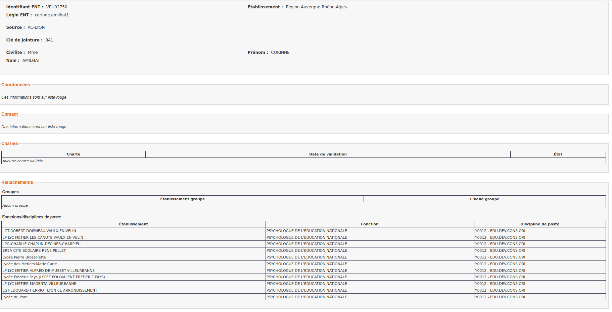

# Préambule non numéroté : Commandes pour compiler {-}

* pour HTML : `pandoc -s sample.md  -c style_nsi.css  --toc   -o  sample.html`

* pour PDF : `pandoc -s sample.md --listings --template=template-pandocV1.tex --filter ./filtre.py -V colorlinks -o sample.pdf`

* pour Beamer :  `pandoc -s sample.md --listings --template=template-pandoc-beamerV1.tex --filter ./filtre.py -V colorlinks -t beamer -V theme=Warsaw -V navigation=vertical -o sample-beamer.pdf`

* Pour Diaporama HTML : `pandoc -s  -V geometry:margin=1.5cm --mathjax -t slidy sample.md  -c style_nsi.css -o sample-slidy.html`

* Pour afficher la structure AST générée à partir du document lu par pandoc : ` pandoc -s -t native   sample.md` , voir  [https://pandoc.org/filters.html](https://pandoc.org/filters.html)

# Section 1

## Sous-Section

--------------------
### Exercice 1

1. question 1
2. question2

* Here is a paragraph.
* And another.
* Un lien  vers [mon site](https://frederic-junier.org/)

~~~python
for k in range(3):
    print(k)
~~~

__Exemple d'environnements minipage juxtaposés__

:::{.minipage  center="true" width="0.2\linewidth"}
Image1 { width=80% }\
&
Image2
{ width=80% }\
&
Image3
{ width=80% }\
&
texte texte texte texte texte texte texte texte texte texte texte texte texte texte texte texte texte texte texte texte texte texte texte texte texte texte 
:::

:::theoreme
Here is a paragraph.

And another.
:::

:::definition
Here is a paragraph.

And another.
:::

{ width=80% }

### Un exemple de tableau 

[http://www.tablesgenerator.com/markdown_tables#](http://www.tablesgenerator.com/markdown_tables#)

Comment juxtaposer des tableaux ? Mon filtre ne fonctionne pas, il place les contenus des minipage dans des  éléments de type {'t' : 'Para'} 
alors que dans un tableau on a des types {'t': 'AlignCenter'} par exemple.

| a | b | a and b |
|:-:|:-:|:-------:|
| 0 | 0 |    0    |
| 0 | 1 |    0    |
| 1 | 0 |    0    |
| 1 | 1 |    1    |

| a | b | a and b |
|:-:|:-:|:-------:|
| 0 | 0 |    0    |
| 0 | 1 |    0    |
| 1 | 0 |    0    |
| 1 | 1 |    1    |

