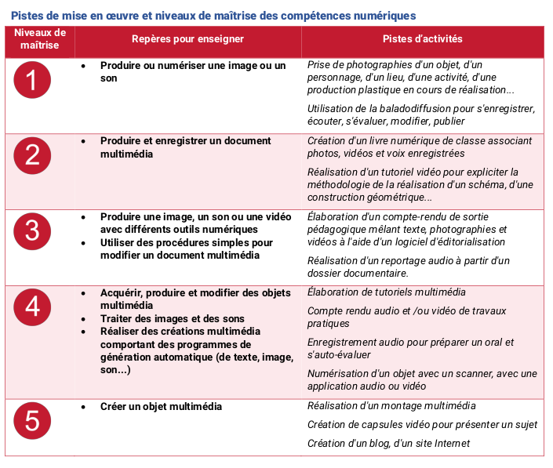

# Section 1

## Sous-Section

--------------------
### Exercice 1

1. question 1
2. question2

* Here is a paragraph.
* And another.
* Un lien [mon site](https://frederic-junier.org/)

~~~python
for k in range(3):
    print(k)
~~~

{ width=50% }\

Here is a paragraph.

And another.

Here is a paragraph.

And another.

### Un exemple de tableau 

[http://www.tablesgenerator.com/markdown_tables#](http://www.tablesgenerator.com/markdown_tables#)

| a | b | a and b |
|:-:|:-:|:-------:|
| 0 | 0 |    0    |
| 0 | 1 |    0    |
| 1 | 0 |    0    |
| 1 | 1 |    1    |
